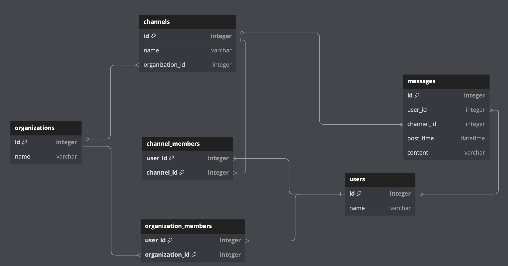

# Project Documentation

## Overview

This project involves the design and implementation of a database schema for a messaging platform. The schema supports multiple organizations, channels within those organizations, users, and messages exchanged within channels. The relationships among these entities are defined to facilitate efficient data retrieval and integrity.

## Entity-Relationship Diagram

The following Entity-Relationship (ER) diagram illustrates the relationships between the entities in the database schema:



## Database Schema

The database consists of the following tables:

1. **organizations**: Stores information about organizations.
2. **channels**: Stores information about channels within organizations.
3. **users**: Stores information about users.
4. **messages**: Stores messages sent by users in channels.
5. **channel_members**: Associates users with channels they are members of.
6. **organization_members**: Associates users with organizations they are members of.

### Table Definitions

```sql
-- Create organizations table
CREATE TABLE organizations (
  id INT PRIMARY KEY,
  name VARCHAR(255) NOT NULL
);

-- Create channels table with organization association
CREATE TABLE channels (
  id INT PRIMARY KEY,
  name VARCHAR(255) NOT NULL,
  organization_id INT NOT NULL,
  FOREIGN KEY (organization_id) REFERENCES organizations(id)
);

-- Create users table
CREATE TABLE users (
  id INT PRIMARY KEY,
  name VARCHAR(255) NOT NULL
);

-- Create messages table with foreign key references to users and channels
CREATE TABLE messages (
  id INT PRIMARY KEY,
  user_id INT NOT NULL,
  channel_id INT NOT NULL,
  post_time DATETIME NOT NULL,
  content VARCHAR(255),
  FOREIGN KEY (user_id) REFERENCES users(id),
  FOREIGN KEY (channel_id) REFERENCES channels(id)
);

-- Create channel_members join table with a composite primary key
CREATE TABLE channel_members (
  user_id INT NOT NULL,
  channel_id INT NOT NULL,
  PRIMARY KEY (user_id, channel_id),
  FOREIGN KEY (user_id) REFERENCES users(id),
  FOREIGN KEY (channel_id) REFERENCES channels(id)
);

-- Create organization_members join table with a composite primary key
CREATE TABLE organization_members (
  user_id INT NOT NULL,
  organization_id INT NOT NULL,
  PRIMARY KEY (user_id, organization_id),
  FOREIGN KEY (user_id) REFERENCES users(id),
  FOREIGN KEY (organization_id) REFERENCES organizations(id)
);
```

### Data Insertion

Sample data is inserted into the tables to demonstrate the functionality of the schema:

```sql
-- Inserting values into the tables

INSERT INTO organizations (id, name)
VALUES (1, 'Lambda School');

INSERT INTO users (id, name)
VALUES
  (1, 'Alice'),
  (2, 'Bob'),
  (3, 'Chris');

INSERT INTO channels (id, name, organization_id)
VALUES
  (1, '#general', 1),
  (2, '#random', 1);

INSERT INTO organization_members (user_id, organization_id)
VALUES
  (1, 1),
  (2, 1),
  (3, 1);

INSERT INTO channel_members (user_id, channel_id)
VALUES
  (1, 1),
  (1, 2),
  (2, 1),
  (3, 2);

INSERT INTO messages (id, user_id, channel_id, post_time, content)
VALUES
  (1, 1, 1, NOW() + INTERVAL 0 SECOND, 'Alice: Hello in #general'),
  (2, 1, 2, NOW() + INTERVAL 1 SECOND, 'Alice: Hello in #random'),
  (3, 2, 1, NOW() + INTERVAL 2 SECOND, 'Bob: Hi in #general'),
  (4, 3, 2, NOW() + INTERVAL 3 SECOND, 'Chris: Hi in #random'),
  (5, 1, 1, NOW() + INTERVAL 4 SECOND, 'Alice: How is everyone in #general?'),
  (6, 2, 1, NOW() + INTERVAL 5 SECOND, 'Bob: Doing well in #general.'),
  (7, 3, 2, NOW() + INTERVAL 6 SECOND, 'Chris: Enjoying #random chat.'),
  (8, 1, 2, NOW() + INTERVAL 7 SECOND, 'Alice: Another message in #random.'),
  (9, 2, 1, NOW() + INTERVAL 8 SECOND, 'Bob: Quick update in #general.'),
  (10, 3, 2, NOW() + INTERVAL 9 SECOND, 'Chris: Final message in #random.'),
  (11, 1, 1, NOW() + INTERVAL 1 SECOND, 'Alice: Checking in on #general.'),
  (12, 2, 2, NOW() + INTERVAL 2 SECOND, 'Bob: Replying to Alice in #random.'),
  (13, 3, 1, NOW() + INTERVAL 3 SECOND, 'Chris: Sharing a joke in #general.'),
  (14, 1, 2, NOW() + INTERVAL 4 SECOND, 'Alice: Laughing at Chris''s joke in #random.'),
  (15, 2, 1, NOW() + INTERVAL 5 SECOND, 'Bob: Announcing a meeting in #general.'),
  (16, 3, 2, NOW() + INTERVAL 6 SECOND, 'Chris: Responding to meeting announcement in #random.'),
  (17, 1, 1, NOW() + INTERVAL 7 SECOND, 'Alice: Confirming attendance in #general.'),
  (18, 2, 2, NOW() + INTERVAL 8 SECOND, 'Bob: Sharing meeting agenda in #random.'),
  (19, 3, 1, NOW() + INTERVAL 9 SECOND, 'Chris: Commenting on agenda in #general.'),
  (20, 1, 2, NOW() + INTERVAL 10 SECOND, 'Alice: Discussing agenda points in #random.'),
  (21, 2, 1, NOW() + INTERVAL 11 SECOND, 'Bob: Providing updates in #general.'),
  (22, 3, 2, NOW() + INTERVAL 12 SECOND, 'Chris: Asking questions in #random.'),
  (23, 1, 1, NOW() + INTERVAL 13 SECOND, 'Alice: Answering questions in #general.'),
  (24, 2, 2, NOW() + INTERVAL 14 SECOND, 'Bob: Sharing resources in #random.'),
  (25, 3, 1, NOW() + INTERVAL 15 SECOND, 'Chris: Thanking Bob in #general.'),
  (26, 1, 2, NOW() + INTERVAL 16 SECOND, 'Alice: Introducing new topic in #random.'),
  (27, 2, 1, NOW() + INTERVAL 17 SECOND, 'Bob: Discussing new topic in #general.'),
  (28, 3, 2, NOW() + INTERVAL 18 SECOND, 'Chris: Sharing insights in #random.'),
  ...
```

# Database Documentation

This document provides an overview of the database schema, including the Entity-Relationship (ER) diagram and SQL queries for various operations.

## Entity-Relationship Diagram

The ER diagram below illustrates the relationships between the tables in the database:

```
Table organizations {
  id integer [pk]
  name varchar
}

Table channels {
  id integer [pk]
  name varchar
  organization_id integer
}

Table users {
  id integer [pk]
  name varchar
}

Table messages {
  id integer [pk]
  user_id integer
  channel_id integer
  post_time datetime
  content varchar
}

Table channel_members {
  user_id integer [pk]
  channel_id integer [pk]
}

Table organization_members {
  user_id integer [pk]
  organization_id integer [pk]
}

// Foreign Key Relationships
Ref: users.id < channel_members.user_id
Ref: channels.id < channel_members.channel_id

Ref: organizations.id < organization_members.organization_id
Ref: users.id < organization_members.user_id

Ref: users.id < messages.user_id
Ref: channels.id < messages.channel_id

// New Relationship: A channel belongs to one organization
Ref: organizations.id < channels.organization_id

```

## SQL Queries

1. **List all organization names:**

   ```sql
   SELECT name AS "Organization Name" FROM organizations;
   ```

2. **List all channel names:**

   ```sql
   SELECT name AS "Channel Name" FROM channels;
   ```

3. **List all channels in each organization:**

   ```sql
   SELECT o.name AS "Organization Name", c.name AS "Channel Name"
   FROM organizations o
   LEFT JOIN channels c ON o.id = c.organization_id;
   ```

4. **List all messages in the `#general` channel, ordered by `post_time` descending:**

   ```sql
   SELECT m.content, c.name AS "Channel", m.post_time
   FROM messages m
   LEFT JOIN channels c ON m.channel_id = c.id
   WHERE c.name = '#general'
   ORDER BY m.post_time DESC;
   ```

5. **List all channels that user 'Alice' belongs to:**

   ```sql
   SELECT c.name AS "Channel List"
   FROM users u
   LEFT JOIN channel_members cm ON u.id = cm.user_id
   LEFT JOIN channels c ON c.id = cm.channel_id
   WHERE u.name = 'Alice';
   ```

6. **List all users that belong to the `#general` channel:**

   ```sql
   SELECT u.name
   FROM channel_members cm
   LEFT JOIN users u ON u.id = cm.user_id
   LEFT JOIN channels c ON c.id = cm.channel_id
   WHERE c.name = '#general';
   ```

7. **List all messages across all channels by user 'Alice':**

   ```sql
   SELECT m.id, m.content, m.channel_id, m.post_time
   FROM messages m
   LEFT JOIN users u ON u.id = m.user_id
   WHERE u.name = 'Alice';
   ```

8. **List all messages in the `#random` channel by user 'Bob':**

   ```sql
   SELECT m.id, m.content, m.post_time
   FROM messages m
   LEFT JOIN users u ON u.id = m.user_id
   LEFT JOIN channels c ON m.channel_id = c.id
   WHERE u.name = 'Bob' AND c.name = '#random';
   ```

9. **Count of messages across all channels per user, ordered by user names in reverse alphabetical order:**

   ```sql
   SELECT u.name AS "User Name", COUNT(m.content) AS "Message Count"
   FROM messages m
   LEFT JOIN users u ON m.user_id = u.id
   GROUP BY u.id
   ORDER BY u.name DESC;
   ```

10. **[Stretch] Count of messages per user per channel:**

    ```sql
    SELECT c.name AS "Channel Name" , count(m.content) AS "Message Count"
    FROM messages m
    LEFT JOIN channels c ON m.channel_id = c.id
    GROUP BY c.id;
    ```

## Cascading Deletes

To automatically delete all messages by a user if that user is deleted from the `users` table, you can define the foreign key constraint with the `ON DELETE CASCADE` option:

```sql
ALTER TABLE messages
ADD CONSTRAINT fk_user
FOREIGN KEY (user_id)
REFERENCES users(id)
ON DELETE CASCADE;
```

This ensures that when a user is deleted, all their associated messages are also removed from the `messages` table.

# Messaging Platform Database Documentation

This document provides an overview of the messaging platform's database schema, including table structures, relationships, and sample SQL queries for common operations. An accompanying entity-relationship diagram (`ERDiagram.png`) visually represents the schema.

## Table Structures

### 1. `organizations`

- **id**: `INT PRIMARY KEY` – Unique identifier for each organization.
- **name**: `VARCHAR(255) NOT NULL` – Name of the organization.

### 2. `channels`

- **id**: `INT PRIMARY KEY` – Unique identifier for each channel.
- **name**: `VARCHAR(255) NOT NULL` – Name of the channel.
- **organization_id**: `INT` – Foreign key referencing `organizations(id)`.

### 3. `users`

- **id**: `INT PRIMARY KEY` – Unique identifier for each user.
- **name**: `VARCHAR(255) NOT NULL` – Name of the user.

### 4. `messages`

- **id**: `INT PRIMARY KEY` – Unique identifier for each message.
- **user_id**: `INT NOT NULL` – Foreign key referencing `users(id)`.
- **channel_id**: `INT NOT NULL` – Foreign key referencing `channels(id)`.
- **post_time**: `DATETIME NOT NULL` – Timestamp of when the message was posted.
- **content**: `VARCHAR(255)` – Content of the message.

### 5. `channel_members`

- **user_id**: `INT NOT NULL` – Foreign key referencing `users(id)`.
- **channel_id**: `INT NOT NULL` – Foreign key referencing `channels(id)`.
- **PRIMARY KEY (user_id, channel_id)** – Composite primary key ensuring a user can join a channel only once.

### 6. `organization_members`

- **user_id**: `INT NOT NULL` – Foreign key referencing `users(id)`.
- **organization_id**: `INT NOT NULL` – Foreign key referencing `organizations(id)`.
- **PRIMARY KEY (user_id, organization_id)** – Composite primary key ensuring a user can join an organization only once.

## Relationships

- **Organizations and Channels**: One-to-many relationship. Each organization can have multiple channels.
- **Users and Organizations**: Many-to-many relationship managed by the `organization_members` table.
- **Users and Channels**: Many-to-many relationship managed by the `channel_members` table.
- **Users and Messages**: One-to-many relationship. Each user can post multiple messages.
- **Channels and Messages**: One-to-many relationship. Each channel can contain multiple messages.
