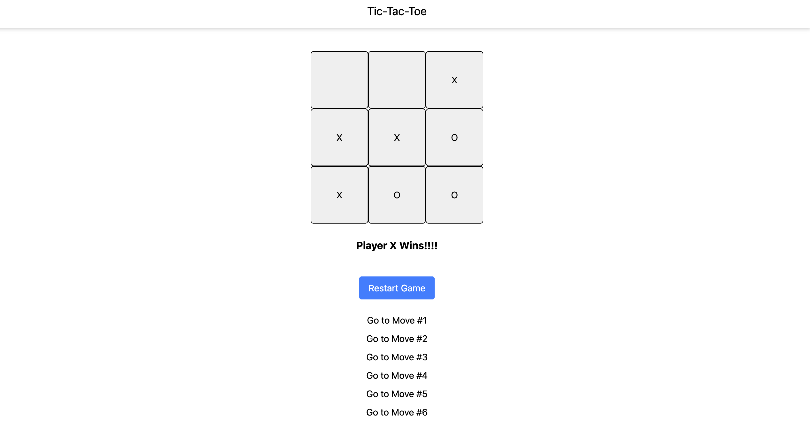

Below is an example of a README.md file you can include in your project repository:

---

# Tic Tac Toe Game – React with Time Travel

This is a tic-tac-toe game built with React Hooks. The project includes the following features:

- **Interactive Board:** A 3×3 grid where players take turns marking "X" or "O".
- **Win Detection:** Automatically detects when a player wins.
- **Move History & Time Travel:** Keeps a history of moves, allowing you to jump back to previous board states.
- **Reset Functionality:** Reset the game at any time to start over.

## Demo



## Features

- **Turn-Based Gameplay:** Alternates turns between "X" and "O".
- **Winner Announcement:** Displays a message when a player wins.
- **History Navigation:** Shows buttons to jump to any previous move.
- **Game Reset:** A reset button clears the board and history, restarting the game.

## Getting Started

These instructions will help you set up and run the project on your local machine.

### Prerequisites

- [Node.js](https://nodejs.org/) (v14 or later)
- [npm](https://www.npmjs.com/) (usually comes with Node.js) or [yarn](https://yarnpkg.com/)

### Installation

1. **Clone the repository:**

   ```bash
   git clone https://github.com/your-username/tic-tac-toe-react.git
   cd tic-tac-toe-react
   ```

2. **Install dependencies:**

   Using npm:

   ```bash
   npm install
   ```

   Or using yarn:

   ```bash
   yarn install
   ```

### Running the Application

To start the development server:

```bash
npm start
```

The app should open automatically in your default browser at `http://localhost:3000`. If not, open it manually.

## Project Structure

```
tic-tac-toe-react/
├── public/
│   ├── index.html
│   └── ...
├── src/
│   ├── components/
│   │   ├── Board.jsx
│   │   └── Square.jsx
│   ├── App.jsx
│   ├── index.js
│   └── styles.css
├── package.json
└── README.md
```

- **App.jsx:** The root component that renders the Board.
- **Board.jsx:** Manages the game state including the board values, current turn, winner, and move history. It passes down click handlers to each Square.
- **Square.jsx:** A functional component that renders an individual square and calls the provided click handler.
- **styles.css:** Contains basic styling for the game.

## How It Works

- **State Management:**  
  The board state, current player's turn, winner, and move history are managed with React's `useState` hook.
- **Handling Moves:**  
  When a square is clicked, the `handleClick` function checks whether the square is empty and whether the game is still ongoing. It then updates the board state, appends the new board to the history, and toggles the turn.
- **Time Travel:**  
  The move history is rendered as a list of buttons. Clicking a button triggers the `handleHistoryClick` function, which updates the board state and current turn based on the selected move.
- **Reset:**  
  The reset button clears all the states and restarts the game.

## Future Enhancements

- Highlight the winning squares.
- Display a draw message if no moves remain and there is no winner.
- Refactor to use a reducer (using `useReducer`) for more complex state management.
- Add animations or sound effects for a better user experience.

## Acknowledgments

This project was inspired by the official React [Tic Tac Toe tutorial](https://react.dev/learn/tutorial-tic-tac-toe) citeturn1search0 and various community examples that showcase state management and time travel in React.  
Feel free to explore other enhancements and learn more about React through additional resources.

## License

This project is licensed under the MIT License. See the [LICENSE](LICENSE) file for details.

---

Feel free to customize this README.md to fit your project's details, add screenshots, or provide further instructions as needed.
